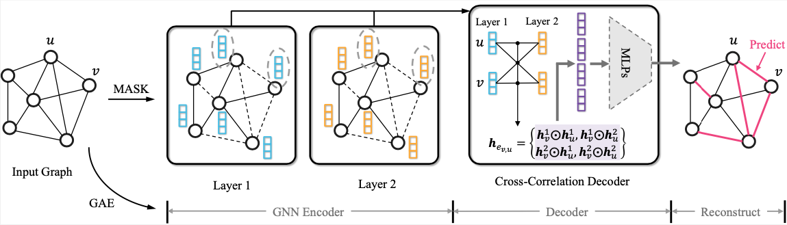

<p>
	
	<br />

</p>

<h1> S2GAE: Self-Supervised Graph Autoencoder </h1>

This is the PyG implementation for WSDM'23 paper: [S2GAE: Self-Supervised Graph Autoencoders Are Generalizable Learners with Graph Masking](https://arxiv.org/pdf/2201.02534.pdf)

S2GAE is a generalized self-supervised graph representation learning method, which achieves competitive or better performance than existing state-of-the-art methods on different types of tasks including *node classification*, *link prediction*, *graph classification*, and *molecular property prediction*.

<h2>Installation</h2>

The required packages can be installed by running `pip install -r requirements.txt`.
<h2>Datasets</h2>
The datasets used in our paper can be automatically downlowad. 

<h2>Quick Start</h2>
For quick start, you could try:

**Node classification** (Cora, CiteSeer, and PubMed)

```
python s2gae_nc_acc.py --dataset `Cora`
```

**Link prediction** (ogbl-ddi, ogbl-collab, and ogbl-ppa)
```
python s2gae_large_lp.py --dataset "ogbl-ddi" 
```

**Graph classification**


<h2> Experimental Results</h2>

Node classification (Accuracy, %)

|                    | Cora         | CiteSeer         | PubMed         | A-Compute      | A-Photo        | Coauthor-CS    | Coauthor-Physics| Ogbn-arxiv     | Ogbn-proteins |
| ------------------ | ------------ | ------------     | ------------   | ------------   | ------------   | ------------   | ------------    | ------------   | --------      |
| MVGRL              | 85.86±0.15     | 73.18±0.22     | 84.86±0.31     | 88.70±0.24     | 92.15±0.20     | 92.87±0.13     | 95.35±0.08      | 68.33±0.31     | -             |
| BGRL               | 86.16±0.20     | 73.96±0.14     | 86.42±0.18     | 90.48±0.10     | 93.22±0.15     | 93.35±0.06     | **96.16±0.09**  | 71.77±0.19     | _             |
| GraphMAE           | 85.45±0.40     | 72.48±0.77     | 85.74±0.14     | 88.04±0.61     | 92.73±0.17     | **93.47±0.04** | 96.13±0.03      | 71.86±0.00     | 60.99±0.21    |
| MaskGAE            | **87.31±0.05** | **75.20±0.07** | 86.56±0.26     | 90.52±0.04     | 93.33±0.14     | 92.31±0.05     | 95.79±0.02      | 70.99±0.12     | 61.23±0.19    |
| **S2GAE(ours)**    | 86.15±0.25     | 74.60±0.06     | **86.91±0.28** | **90.94±0.08** | **93.61±0.10** | 91.70±0.08     | 95.82±0.03      | **72.02±0.05** | **63.33±0.12**|


Link prediction (AUC)

|                    | Cora           | CiteSeer       | PubMed         | Blogcatalog    | Flickr         | Ogbl-ddi       | Ogbl-collab    | Ogbl-ppa       |
| ------------------ | -------------- | -------------- | -------------- | -------------- | -------------- | -------------- | -------------- | -------------- |
| AUC                |      AUC       |  AUC           |   AUC          |   AUC          |   AUC          |  Hits@20       |   Hits@50      | Hits@10        |
| GAE                | 91.09±0.01     | 90.52±0.04     | 96.40±0.01     | 84.91±1.44     | 92.50±0.40     | 37.07±5.07     | 44.75±1.07     | 2.52±0.47      | 
| GraphMAE           | 89.19±0.00     | 91.20±0.11     | 93.72±0.00     | 76.60±1.32     | 88.69±0.04     | -              | 22.79±1.62     | 0.18±0.28      |
| MaskGAE            | **96.66±0.17** | **98.00±0.23** | **99.06±0.05** | 81.06±3.06     | 93.60±0.14     | 16.25±1.60     | 32.47±0.59     | 0.23±0.04      |
| **S2GAE(ours)**    | 95.05±0.76     | 94.85±0.49     | 97.38±0.17     | **87.06±0.37** | **94.38±0.02** | **65.91±3.50** | **54.74±1.06** | **3.98±1.33**  |

Graph classification (Accuracy, %)

|                    | IMDB-B         | IMDB-M         | PROTEINS       | COLLAB         | MUTAG          | REDDIT-B       | NCI1           |
| ------------------ | -------------- | -------------- | -------------- | -------------- | -------------- | -------------- | -------------- |
| InfoGraph          | 73.03±0.87     | 49.69±0.53     | 74.44±0.31     | 70.65±1.13     | **91.20±1.30** | -              | 76.20±1.06     |
| GraphCL            | 71.14±0.44     | 48.58±0.67     | 74.39±0.45     | 71.36±1.15     | 86.80±1.34     | **89.53±0.84** | 77.87±0.41     |
| MVGRL              | 74.20±0.70     | 51.20±0.50     | -              | -              | 89.70±1.10     | 84.50±0.60     | -              |
| GraphMAE           | 75.52±0.66     | 51.63±0.52     | 75.30±0.39     | 80.32±0.46     | 88.19±1.26     | 88.01±0.19     | 80.40±0.30     |
| **S2GAE(ours)**    | **75.76±0.62** | **51.79±0.36** | **76.37±0.43** | **81.02±0.53** | 88.26±0.76     | 87.83±0.27     | **80.80±0.24** |


<h1>Citing</h1>

If you find this work is helpful to your research, please consider citing our paper:

```
@inproceedings{tan2023s2gae,
  title={S2GAE: Self-Supervised Graph Autoencoders Are Generalizable Learners with Graph Masking},
  author={Tan, Qiaoyu and Liu, Ninghao and Huang, Xiao and Choi, Soo-Hyun and Li, Li and Chen, Rui and Hu, Xia},
  booktitle={Proceedings of the 16th ACM International Conference on Web Search and Data Mining},
  year={2023}
}
```

```
@article{tan2022mgae,
  title={Mgae: Masked autoencoders for self-supervised learning on graphs},
  author={Tan, Qiaoyu and Liu, Ninghao and Huang, Xiao and Chen, Rui and Choi, Soo-Hyun and Hu, Xia},
  journal={arXiv preprint arXiv:2201.02534},
  year={2022}
}

```